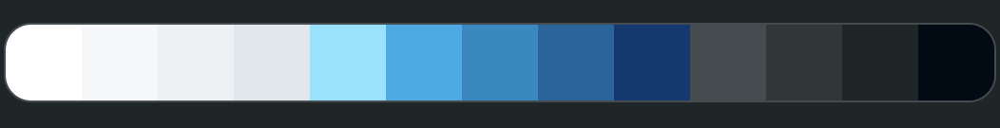
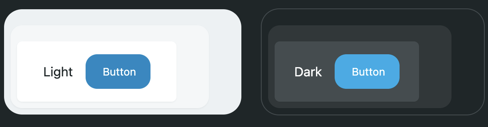

# WindWeave UI

Extends your project's TailwindCSS config with a wider range of text, size, and color options based on theme variables for building more consistent visual layouts. Also includes a set of common UI-related components for use in Svelte projects.

Requires [TailwindCSS](https://tailwindcss.com/) v4.

Components require [Svelte](https://svelte.dev/) 5. -  *[View components documentation](#components)*

## Usage

Install the package

```sh
npm i -D windweaveui
```

Import the stylesheets into your project below the TailwindCSS import

```css
/* layout.css */
@import 'tailwindcss';

@import "windweaveui/windweave-ui.css" layer(components);
@import "windweaveui/loading-ring.css";
```

## Classes

### Additional Colors

A set of theme color-scale classes have been added to make building UI elements in light or dark mode with sufficient contrast more convenient. Additionally, standard colors have been added for error, warning, and success state text and backgrounds.




These classes work with all color-based Tailwind styles such as `bg-*`, `text-*`, and `ring-*`.

| Class | Description |
| ---- | ---- |
| *-theme-50 | Light background level 1 |
| *-theme-100 | Light background level 2 |
| *-theme-200 | Light background level 3 |
| *-theme-300 | Theme-scale high-vis text background |
| *-theme-400 | Theme-scale dark--mode base color |
| *-theme-500 | Theme-scale light-mode base color |
| *-theme-600 | Theme-scale background |
| *-theme-700 | Theme-scale high-vis text |
| *-theme-800 | Dark background level 1 |
| *-theme-900 | Dark background level 2 |
| *-theme-950 | Dark background level 3 |
| *-black | Replaces the default black with a very dark theme-tinted black. |
| *-error-100 | Light-mode background |
| *-error-400 | Dark-mode text |
| *-error-500 | Light-mode text |
| *-error-900 | Dark-mode background |
| *-warn-100 | Light-mode background |
| *-warn-400 | Dark-mode text |
| *-warn-500 | Light-mode text |
| *-warn-900 | Dark-mode background |
| *-success-100 | Light-mode background |
| *-success-400 | Dark-mode text |
| *-success-500 | Light-mode text |
| *-success-900 | Dark-mode background |

To set the base theme color, add the following variables with your own values to your project:

```css
:root {
    --theme-hue: 220; /* 0 to 360 based on color wheel */
    --theme-saturation: 0.2; /* 0 to 0.4, higher saturations will fallback to alternate values on some monitors */
    --theme-lightness: 0.56; /* 0 (black) to 1 (white) */
}
```

### Page Width & Containers

Set content max-widths with a single class using `page-*` which also adds standard x-axis padding to all content sections, keeping content aligned. Use `pod-*` to add standard padding to content boxes or inner sections.

| Class | Description |
| ---- | ---- |
| page-w-xs | Very narrow content section |
| page-w-sm | Narrow content section |
| page-w | Normal content section |
| page-w-lg | Wide content section |
| pod-sm | Adds standard padding to a small content box |
| pod | Adds standard padding to a medium content box |
| pod-lg | Adds standard padding to a large content box |

To adjust the base width of your content, add the following variables with your own values to your project:

```css
:root {
    --page-width: 1400px; /* sets the standard content width */
}
```

### Font Size

All TailwindCSS default font sizes have been replaced with dynamically resizing sizes - fonts will appear smaller on smaller screen sizes. Additional range has been added to the default font scale as well. All font sizes now use a consistent line height which can be overridden using the new `leading-*` presets.

| Class | Base font size / line height |
| ---- | ---- |
| text-3xs | 0.68rem |
| text-2xs | 0.74rem |
| text-xs | 0.83rem |
| text-sm | 0.875rem |
| text-md | 0.94rem |
| text-base | 1rem |
| text-lg | 1.15rem |
| text-xl | 1.32rem |
| text-2xl | 1.5rem |
| text-3xl | 1.875rem |
| text-4xl | 2.25rem |
| text-5xl | 3rem |
| text-6xl | 3.75rem |
| text-7xl | 4.5rem |
| leading-none | 1 |
| leading-sm | 1.15 |
| leading-base | 1.3 |
| leading-lg | 1.6 |
| leading-xl | 1.9 |

Global font size can be adjusted for font file differences by adjusting the base font size:
```css
:root {
    font-size: 16px; /* default */
}
```

### Border Radius & Rounding

For consistent corners throughout your app, use `round`, `round-inner`, and `round-outer` to apply standard border radii to sections, buttons, and inputs.

| Class | Description |
| ---- | ---- |
| round | Base radius |
| round-inner-sm | Use on elements spaced 0.25rem (p-1) inside of the base radius |
| round-outer-sm | Use on elements spaced 0.25rem (p-1) outside of the base radius |
| round-inner | Use on elements spaced 0.5rem (p-2) inside of the base radius |
| round-outer | Use on elements spaced 0.5rem (p-2) outside of the base radius |
| round-inner-lg | Use on elements spaced 0.75rem (p-3) inside of the base radius |
| round-outer-lg | Use on elements spaced 0.75rem (p-3) outside of the base radius |

To adjust the base rouding of your content, add the following variables with your own values to your project:

```css
:root {
    --corner-radius: 0.9rem; /* sets the standard content rounding */
}
```

### Touch Elements & Inputs

Apply standard padding and active states to all touch elements using `touch` to ensure that they are easily usable on all screen sizes and maintain a consistent appearance. Use `input` on input or textarea elements to add the same standards.

If custom padding is needed on a button, use `touch-custom` to apply all classes except padding.

| Class | Description |
| ---- | ---- |
| touch | Apply standard styles to touch elements such as buttons |
| input | Standard styles for input elements |
| no-arrows | Removes increase/decrease arrows from number inputs - must be applied to the parent element |

### HTML Standard Styles

Apply standard styles to an HTML block or content pulled from a CMS using `html`.

| Class | Description |
| ---- | ---- |
| html | Adds default styles to all typical HTML editor elements |

### Scrollbar

Use `no-scrollbar` to hide the scrollbar on an element with overflow.

| Class | Description |
| ---- | ---- |
| no-scrollbar | Sets the scrollbar width to 0px |


## Components

### Page Loading Indicator

Adds a loading indicator bar to the top of the page to give users a visual indication that navigation is occurring.

```html
// +layout.svelte

<script lang="ts">
    import { PageLoadIndicator } from "windweaveui"
</script>

<div>
    <PageLoadIndicator excludedPaths={["/"]} />
    <main>
        {@render children()}
    </main>
</div>
```

| Parameter | Details |
| --- | --- |
| class | Optional `string` - Appends an additional class string to the component |
| includedPaths | Optional `string[]` - The page loader will only display for the specified routes |
| excludedPaths | Optional `string[]` - These routes are excluded from showing the loading indicator. Only used if `includedPaths` is undefined. |
| showOnlyParamChange | Optional `boolean` - If true, the loading indicator will only be shown when the page search parameters change, not on navigation between pages. |

### Loading Ring

```html
// *.svelte

<script lang="ts">
    import { LoadingRing } from "windweaveui"
    // Must also import the loading ring CSS in your project TailwindCSS config
</script>

<div>
    <LoadingRing class="size-6 text-theme-500" />
</div>
```

| Parameter | Details |
| --- | --- |
| class | Optional `string` - Appends an additional class string to the component |
